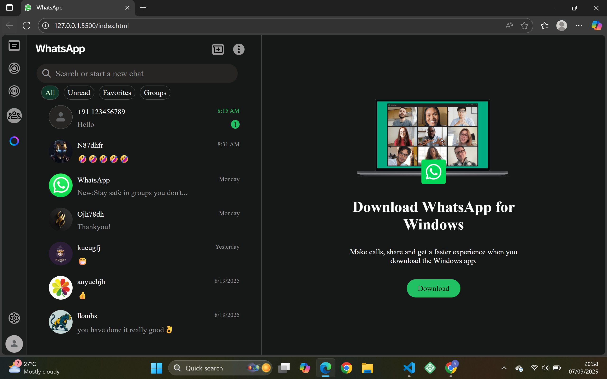

# 💬 WhatsApp Web Clone

A responsive WhatsApp Web UI clone built using HTML and CSS.
This project replicates the layout and design of WhatsApp Web, focusing on UI structure, chat layout, and responsive design.

---

## 🚀 Features

* 💬 WhatsApp-style chat interface
* 🧭 Sidebar with chats and contacts
* 📱 Responsive design (works on different screen sizes)
* 🎨 Clean and modern UI
* ⚡ Lightweight (pure HTML & CSS)

---

## 🛠️ Technologies Used

* HTML5
* CSS3

---

## 🌍 Live Demo

🔗 https://varun-kumar-reddy-p.github.io/WhatsApp_web/

---

## 📸 Preview

 

---

## 📂 Project Structure

```id="n3x9qa"
WhatsApp_web/
│── index.html
│── style.css
│── img/
```

---

## 🎯 Purpose

This project was developed to:

* Practice real-world UI cloning
* Improve CSS layout skills (Flexbox/Grid)
* Understand chat-based interface design

---

## 📌 Future Improvements

* Add JavaScript for real-time chat interactions
* Implement message sending functionality
* Add animations and transitions
* Improve responsiveness for smaller devices

---

## 👨‍💻 Author

**Varun Kumar Reddy**

* GitHub: https://github.com/Varun-Kumar-Reddy-P
* LinkedIn: https://linkedin.com/in/varunkumarreddypothula/

---

## ⭐ Support

If you found this project useful, consider giving it a ⭐ on GitHub!
